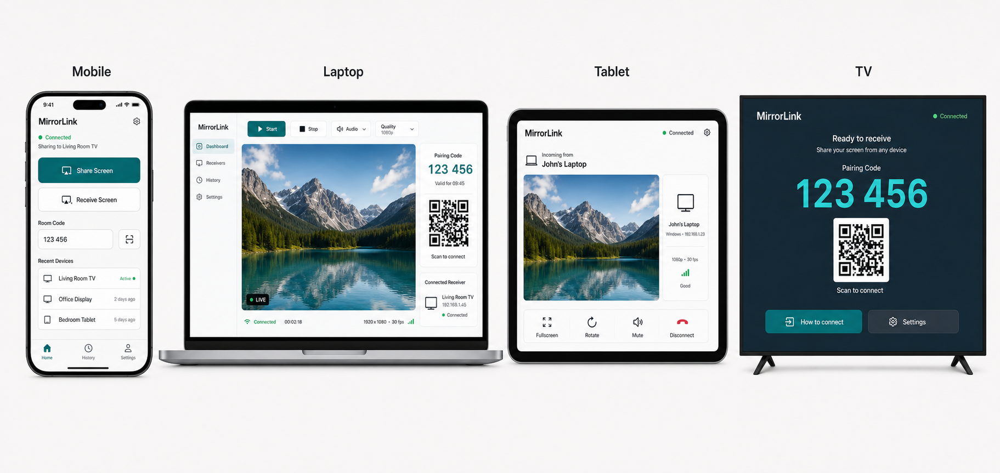

# UI Prototype

The first concept board is stored at:

## Product Direction

MirrorLink should feel professional, practical, and trustworthy. The interface should make the main action obvious without feeling like a marketing page.

## v1 Screens

### Mobile

- Home screen with Share Screen and Receive Screen
- Room code input
- QR scan entry
- Active connection state
- Receiver stream view

### Laptop

- Sender dashboard
- Screen preview area
- Start/stop controls
- Room code and QR pairing panel
- Connected receiver status

### Tablet

- Receiver-first layout
- Stream preview/player
- Fullscreen, rotate, mute, and disconnect controls
- Device info panel

### TV

- Receiver lobby
- Large room code
- QR pairing
- Remote-friendly controls
- Fullscreen stream view

## Design Notes

- Keep controls readable from a distance on TV.
- Avoid nested card-heavy layouts.
- Use stable control sizes so labels do not shift the layout.
- Use clear icons for common actions.
- Keep the receiver flow faster than the sender flow.
